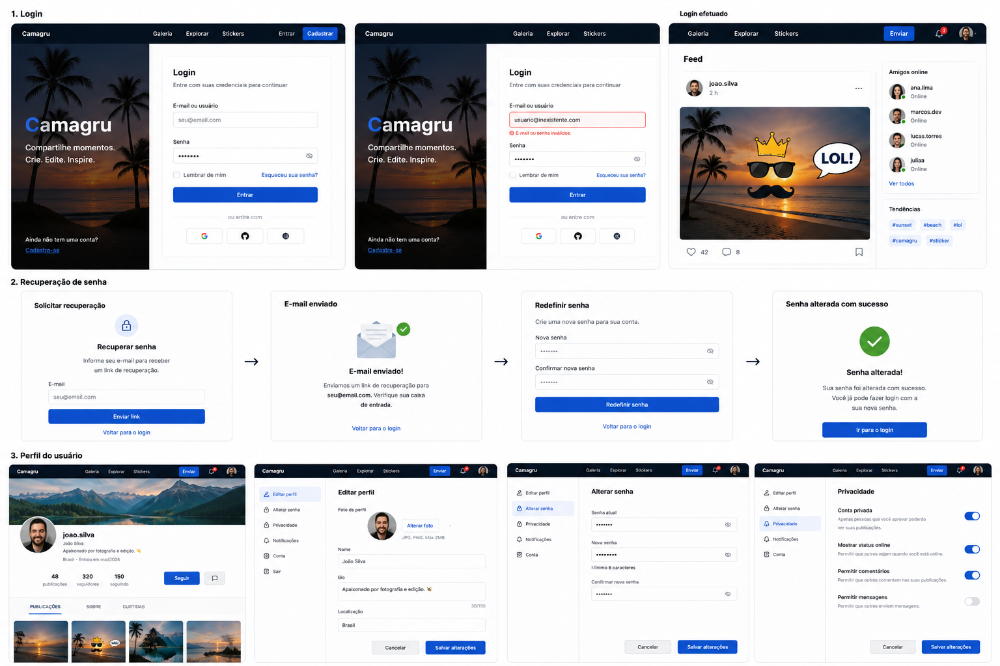
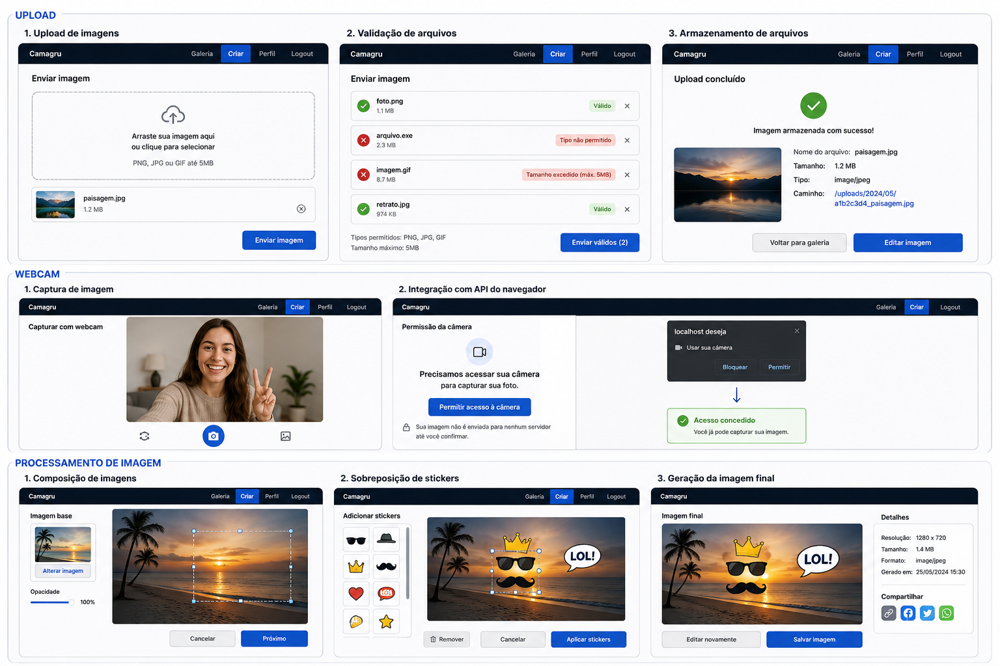
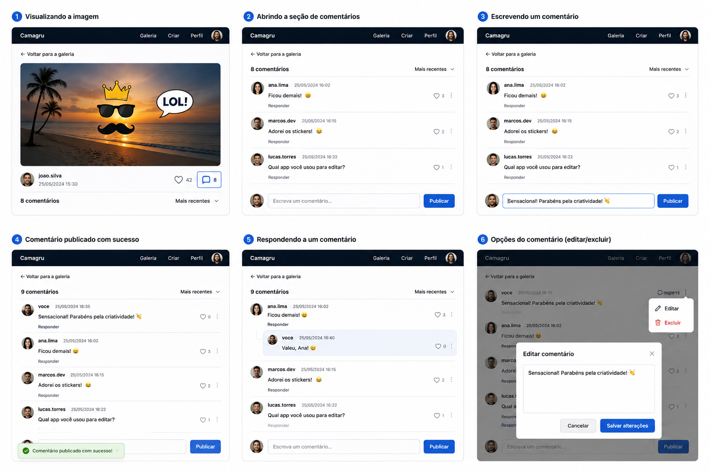

# Camagru

# Objetivo

Desenvolver uma aplicação web que permita aos usuários capturar imagens pela webcam ou realizar upload de arquivos, aplicar stickers, gerar uma composição de imagem no servidor, publicar o resultado em uma galeria pública e interagir através de reações e comentários, garantindo autenticação, segurança, responsividade e extensibilidade da plataforma.

---

# Escopo

## Inclui

- Cadastro de usuários
- Autenticação
- Recuperação de senha
- Confirmação de e-mail
- Gerenciamento de perfil
- Captura de imagem pela webcam
- Upload de imagens
- Processamento de imagens no servidor
- Publicação em galeria pública
- Reações
- Comentários
- Notificações por e-mail
- Paginação
- Segurança da aplicação
- Containerização

## Não inclui

- Chat
- Mensagens privadas
- Compartilhamento em redes sociais
- Streaming de vídeo
- Aplicativo mobile

---

# Requisitos Funcionais Obrigatórios

## Usuários

| Código | Requisito                                                     |
| ------- | ------------------------------------------------------------- |
| RF001   | Permitir o cadastro de novos usuários.                       |
| RF002   | Confirmar a conta por meio de um link enviado por e-mail.     |
| RF003   | Permitir autenticação utilizando nome de usuário e senha.  |
| RF004   | Permitir encerramento da sessão (logout).                    |
| RF005   | Permitir recuperação de senha por e-mail.                   |
| RF006   | Permitir alteração de nome de usuário, e-mail e senha.     |
| RF007   | Permitir gerenciamento das informações públicas do perfil. |

---

## Publicações

| Código | Requisito                                                              |
| ------- | ---------------------------------------------------------------------- |
| RF008   | Permitir captura de imagem utilizando a webcam.                        |
| RF009   | Permitir upload de imagem local.                                       |
| RF010   | Permitir seleção de um sticker antes da captura ou upload da imagem. |
| RF011   | Gerar a composição final da imagem exclusivamente no servidor.       |
| RF012   | Publicar a imagem gerada na galeria pública.                          |
| RF013   | Permitir que o usuário exclua apenas suas próprias publicações.    |

---

## Galeria

| Código | Requisito                                                                   |
| ------- | --------------------------------------------------------------------------- |
| RF014   | Exibir publicamente todas as publicações ordenadas por data de criação. |
| RF015   | Exibir as publicações utilizando paginação.                             |
| RF016   | Permitir que usuários autenticados comentem publicações.                 |
| RF017   | Permitir que usuários autenticados reajam às publicações.               |

---

## Notificações

| Código | Requisito                                                                     |
| ------- | ----------------------------------------------------------------------------- |
| RF018   | Enviar e-mail para confirmação de cadastro.                                 |
| RF019   | Enviar e-mail para recuperação de senha.                                    |
| RF020   | Notificar o autor quando uma publicação receber um novo comentário.        |
| RF021   | Permitir ao usuário habilitar ou desabilitar notificações de comentários. |

---

# Requisitos Não Funcionais

| Código | Requisito                                                              |
| ------- | ---------------------------------------------------------------------- |
| RNF001  | Interface responsiva para diferentes resoluções.                     |
| RNF002  | Compatibilidade com Firefox.                                           |
| RNF003  | Compatibilidade com Chrome.                                            |
| RNF004  | Utilizar containerização com Docker.                                 |
| RNF005  | Armazenar credenciais e variáveis sensíveis fora do código-fonte.   |
| RNF006  | Armazenar senhas utilizando algoritmo criptográfico seguro (BCrypt).  |
| RNF007  | Proteger a aplicação contra SQL Injection.                           |
| RNF008  | Proteger a aplicação contra Cross Site Scripting (XSS).              |
| RNF009  | Proteger a aplicação contra Cross Site Request Forgery (CSRF).       |
| RNF010  | Validar o upload por extensão, MIME Type e tamanho máximo permitido. |
| RNF011  | Processar a composição da imagem exclusivamente no servidor.         |

---

# Funcionalidades Bônus

As funcionalidades abaixo representam evoluções da aplicação e não fazem parte dos requisitos obrigatórios definidos pela especificação original do projeto.

---

## Administração

| Código | Requisito                                                                             |
| ------- | ------------------------------------------------------------------------------------- |
| RB001   | Disponibilizar área administrativa protegida por papéis de acesso.                  |
| RB002   | Permitir atribuição de papéis aos usuários (Usuário, Moderador e Administrador). |
| RB003   | Permitir configurar a quantidade máxima de mídias por publicação.                 |
| RB004   | Permitir configurar o tamanho máximo permitido para upload de arquivos.              |
| RB005   | Permitir cadastrar, habilitar e desabilitar tipos de mídia aceitos pela aplicação. |
| RB006   | Permitir configurar o tamanho máximo da descrição das publicações.               |
| RB007   | Permitir configurar o tamanho máximo dos comentários.                               |
| RB008   | Permitir cadastrar, habilitar e desabilitar reações disponíveis.                   |
| RB009   | Permitir cadastrar, habilitar e desabilitar stickers disponíveis.                    |

---

## Moderação

| Código | Requisito                                                 |
| ------- | --------------------------------------------------------- |
| RB010   | Permitir moderação de publicações.                    |
| RB011   | Permitir moderação de usuários.                        |
| RB012   | Exigir justificativa para toda ação de moderação.     |
| RB013   | Utilizar catálogo configurável de tipos de moderação. |

---

## Rede Social

| Código | Requisito                                                                    |
| ------- | ---------------------------------------------------------------------------- |
| RB014   | Permitir que usuários sigam outros usuários.                               |
| RB015   | Permitir respostas a comentários.                                           |
| RB016   | Disponibilizar múltiplos tipos de reação configuráveis.                  |
| RB017   | Registrar os stickers utilizados em cada publicação para fins analíticos. |

---

## Experiência do Usuário

| Código | Requisito                                               |
| ------- | ------------------------------------------------------- |
| RB018   | Atualizar reações sem recarregar a página (AJAX).    |
| RB019   | Atualizar comentários sem recarregar a página (AJAX). |
| RB020   | Realizar upload assíncrono de arquivos.                |

---

# Protótipos de Interface

Durante a etapa de levantamento de requisitos foram produzidos **protótipos** de interface utilizando **Inteligência Artificial**.

Os protótipos têm como objetivo representar uma possível experiência de uso da aplicação, auxiliando na validação dos requisitos funcionais, na organização dos fluxos de navegação e na definição das principais telas antes do início da implementação.

Estas imagens possuem caráter ilustrativo e não representam o layout definitivo da aplicação. Durante o desenvolvimento poderão ocorrer alterações de usabilidade, identidade visual e organização dos componentes conforme a evolução do projeto.

## Autenticação e Perfil

As telas desta seção representam os fluxos relacionados à autenticação do usuário, recuperação de senha e gerenciamento do perfil.

Fluxos ilustrados:

- Login
- Recuperação de senha
- Redefinição de senha
- Perfil do usuário
- Alteração de senha
- Configurações de privacidade

## Upload e Processamento de Imagens

Esta seção apresenta um exemplo de fluxo para criação de uma publicação.

Fluxos ilustrados:

- Upload de imagens
- Validação de arquivos
- Captura pela webcam
- Permissão da câmera
- Composição da imagem
- Aplicação de stickers
- Geração da imagem final

## Publicação e Interação

Esta seção apresenta um exemplo de interação entre usuários na galeria da aplicação.

Fluxos ilustrados:

- Visualização de publicação
- Listagem de comentários
- Publicação de comentários
- Resposta a comentários
- Edição de comentários
- Exclusão de comentários

# Considerações

Os protótipos apresentados servem como apoio ao processo de análise e levantamento de requisitos.

Em conjunto com as regras de negócio e com a modelagem de dados, eles representam uma visão preliminar do produto, permitindo validar funcionalidades, fluxos de navegação e experiência do usuário antes do início da implementação.

Durante o desenvolvimento, tanto os protótipos quanto a documentação poderão evoluir de forma incremental, acompanhando a maturidade da aplicação.
