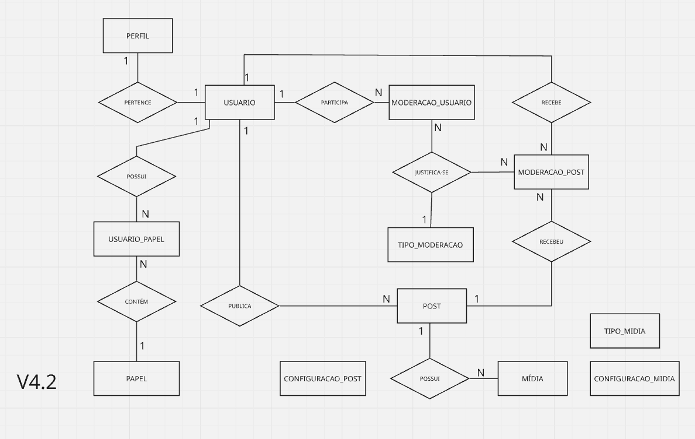

# Modelagem de Dados

# Objetivo

Este documento apresenta a modelagem de dados desenvolvida para a aplicação Camagru.

O processo de modelagem evoluiu iterativamente até a consolidação da versão V4.2 do modelo conceitual e da versão V2.1 do modelo lógico. As versões finais representam a estrutura de dados que será materializada no banco de dados PostgreSQL.

---

# Modelo Conceitual (V4)

O modelo conceitual V4 representa o núcleo da rede social.

Nesta etapa foram consolidadas as entidades responsáveis pelo funcionamento da aplicação, contemplando autenticação, perfil do usuário, publicações, mídias, comentários, reações, stickers e relacionamento entre usuários.

As entidades associativas foram utilizadas para eliminar relacionamentos muitos-para-muitos, permitindo maior flexibilidade para futuras evoluções, consultas analíticas e manutenção do modelo.

## Entidades

| Entidade | Descrição |
|----------|-----------|
| Usuário | Representa a conta utilizada para autenticação e autoria das publicações. |
| Perfil | Armazena as informações públicas do usuário. |
| Post | Representa uma publicação criada por um usuário. |
| Mídia | Representa um arquivo pertencente a uma publicação. |
| Comentário | Representa comentários realizados em uma publicação, permitindo respostas por meio de autorrelacionamento. |
| Reação | Catálogo dos tipos de reação disponíveis na plataforma. |
| Post_Reação | Registra a reação realizada por um usuário em uma publicação. |
| Sticker | Catálogo de stickers disponíveis para composição de imagens. |
| Post_Sticker | Registra os stickers utilizados na composição de uma publicação. |
| Segue | Representa o relacionamento entre usuários da rede social. |

---

## Relacionamentos

| Origem | Destino | Cardinalidade | Descrição |
|---------|----------|---------------|-----------|
| Usuário | Perfil | 1 : 1 | Cada usuário possui exatamente um perfil. |
| Usuário | Post | 1 : N | Um usuário pode publicar diversas publicações. |
| Post | Mídia | 1 : N | Uma publicação possui uma ou mais mídias. |
| Usuário | Comentário | 1 : N | Um usuário pode realizar diversos comentários. |
| Post | Comentário | 1 : N | Uma publicação pode possuir diversos comentários. |
| Comentário | Comentário | 0..1 : 0..N | Permite respostas entre comentários. |
| Usuário | Post_Reação | 1 : N | Um usuário pode reagir a diversas publicações. |
| Reação | Post_Reação | 1 : N | Uma reação pode ser utilizada em diversas ocorrências. |
| Post | Post_Reação | 1 : N | Uma publicação pode receber diversas reações. |
| Sticker | Post_Sticker | 1 : N | Um sticker pode ser utilizado em diversas publicações. |
| Post | Post_Sticker | 1 : N | Uma publicação pode utilizar diversos stickers. |
| Usuário | Segue | 1 : N | Um usuário pode seguir diversos usuários. |

---

## Entidades Associativas

| Entidade | Finalidade |
|----------|------------|
| Post_Reação | Registrar as reações realizadas pelos usuários nas publicações. |
| Post_Sticker | Registrar os stickers utilizados durante a composição da imagem publicada. |
| Segue | Representar o relacionamento entre usuários da rede social. |

---

# Modelo Lógico (V2)

O modelo lógico representa a transformação do modelo conceitual para uma estrutura pronta para implementação em banco de dados relacional.

Nesta etapa foram definidos os atributos, chaves primárias, chaves estrangeiras e restrições de integridade das entidades pertencentes ao núcleo da rede social.

---

# Módulo de Moderação e Administração

O módulo de moderação foi desenvolvido para permitir ações administrativas sobre usuários e publicações sem alterar o núcleo da aplicação.

As ações de moderação utilizam um catálogo único de tipos de moderação, permitindo reutilização entre diferentes domínios (Usuário e Publicação).

O módulo de administração concentra os elementos responsáveis pela parametrização da aplicação e pelo gerenciamento de permissões de acesso.

As configurações administrativas permanecem desacopladas do domínio principal da rede social, permitindo evolução sem impacto sobre as entidades centrais.

## Entidades de moderação

| Entidade | Descrição |
|----------|-----------|
| Moderacao_Usuario | Registra ações de moderação realizadas sobre usuários. |
| Moderacao_Post | Registra ações de moderação realizadas sobre publicações. |
| Tipo_Moderação | Catálogo de tipos de moderação disponíveis. |

## Relacionamentos de moderação

| Origem | Destino | Cardinalidade | Descrição |
|---------|----------|---------------|-----------|
| Usuário | Moderacao_Usuario | 1 : N | Um moderador pode executar diversas ações sobre usuários. |
| Usuário | Moderacao_Post | 1 : N | Um moderador pode executar diversas ações sobre publicações. |
| Post | Moderacao_Post | 1 : N | Uma publicação pode receber diversas ações de moderação. |
| Tipo_Moderação | Moderacao_Usuario | 1 : N | Um tipo de moderação pode ser utilizado em diversas ocorrências. |
| Tipo_Moderação | Moderacao_Post | 1 : N | Um tipo de moderação pode ser utilizado em diversas ocorrências. |

## Entidades de administração

| Entidade | Descrição |
|----------|-----------|
| Papel | Catálogo dos papéis de acesso disponíveis na aplicação. |
| Usuario_Papel | Associação entre usuários e papéis de acesso. |
| Configuracao_Post | Define parâmetros relacionados às publicações. |
| Configuracao_Midia | Define parâmetros relacionados ao upload de mídias. |
| Tipo_Midia | Catálogo de formatos de mídia permitidos pela aplicação. |

## Relacionamentos de administração

| Origem | Destino | Cardinalidade | Descrição |
|---------|----------|---------------|-----------|
| Usuário | Usuario_Papel | 1 : N | Um usuário pode possuir um ou mais papéis. |
| Papel | Usuario_Papel | 1 : N | Um papel pode ser atribuído a diversos usuários. |

---

# Modelo Lógico da Moderação e Administração

Nesta etapa foram definidos os atributos necessários para persistência das ações de moderação, incluindo os relacionamentos com usuários, publicações e catálogo de tipos de moderação.

O modelo lógico da administração define a estrutura física responsável pela persistência das configurações da aplicação e dos papéis de acesso utilizados pelos módulos administrativos e de moderação.

# Considerações Finais

Ao término da modelagem foram consolidados quatro grandes módulos do sistema:

- **Rede Social**, responsável pelas funcionalidades principais da aplicação.
- **Segurança**, responsável pelo controle de papéis e permissões de acesso.
- **Moderação**, responsável pelas ações administrativas sobre usuários e publicações.
- **Administração**, responsável pela parametrização da aplicação e gerenciamento de catálogos.

A separação em módulos permitiu manter alta coesão entre as entidades, reduzir acoplamento entre domínios e facilitar futuras evoluções do sistema sem alterações estruturais significativas no modelo de dados.