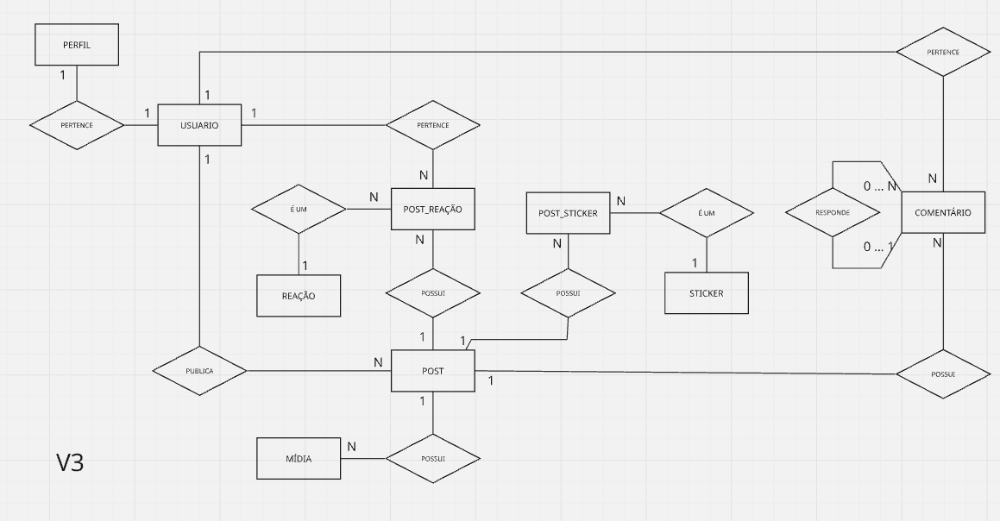

# Artefatos definidos na modelagem de dados

Na finalização da terceira versão da modelagem de dados, a versão que seguirá para o modelo lógico ficaram definidas as seguintes entidades:

## Modelo conceitual

---

## Definições 

### Entidades

| Entidade      | Descrição                                                                   |
| ------------- | ----------------------------------------------------------------------------- |
| Usuário      | Representa a conta utilizada para autenticação e autoria das publicações. |
| Perfil        | Armazena as informações públicas do usuário.                              |
| Post          | Representa uma publicação realizada por um usuário.                        |
| Mídia        | Representa um arquivo pertencente a um post.                                  |
| Comentário   | Representa comentários realizados sobre um post.                             |
| Reação      | Catálogo dos tipos de reação disponíveis (Curtir, Amar, etc.).            |
| Post_Reação | Registra uma reação aplicada por um usuário em um post.                    |
| Sticker       | Catálogo dos stickers disponíveis para composição de imagens.             |
| Post_Sticker  | Registra quais stickers foram utilizados na composição de um post.          |

### Relacionamentos

| Origem      | Relacionamento | Destino       | Cardinalidade         | Regra de negócio                                                             |
| ----------- | -------------- | ------------- | --------------------- | ----------------------------------------------------------------------------- |
| Usuário    | possui         | Perfil        | **1 : 1**       | Cada usuário possui exatamente um perfil.                                    |
| Usuário    | publica        | Post          | **1 : N**       | Um usuário pode publicar vários posts.                                      |
| Post        | possui         | Mídia        | **1 : N**       | Um post pode possuir uma ou várias mídias.                                  |
| Usuário    | cria           | Comentário   | **1 : N**       | Um usuário pode criar diversos comentários.                                 |
| Post        | possui         | Comentário   | **1 : N**       | Um post pode possuir diversos comentários.                                   |
| Comentário | responde       | Comentário   | **0..1 : 0..N** | Um comentário pode responder outro comentário e receber diversas respostas. |
| Usuário    | realiza        | Post_Reação | **1 : N**       | Um usuário pode reagir diversas vezes.                                       |
| Post        | possui         | Post_Reação | **1 : N**       | Um post pode receber diversas reações.                                      |
| Reação    | classifica     | Post_Reação | **1 : N**       | Um tipo de reação pode ser utilizado em diversas ocorrências.              |
| Post        | possui         | Post_Sticker  | **1 : N**       | Um post pode utilizar diversos stickers.                                      |
| Sticker     | classifica     | Post_Sticker  | **1 : N**       | Um sticker pode ser utilizado em diversas ocorrências.                       |

### Entidades Associativas

| Entidade      | Resolve qual relacionamento? | Finalidade                                                                   |
| ------------- | ---------------------------- | ---------------------------------------------------------------------------- |
| Post_Reação | Usuário × Post × Reação | Registrar cada reação realizada em um post.                                |
| Post_Sticker  | Post × Sticker              | Registrar quais stickers foram utilizados na composição da imagem do post. |

---

## Modelo Lógico

.