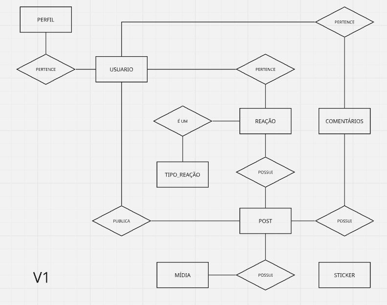
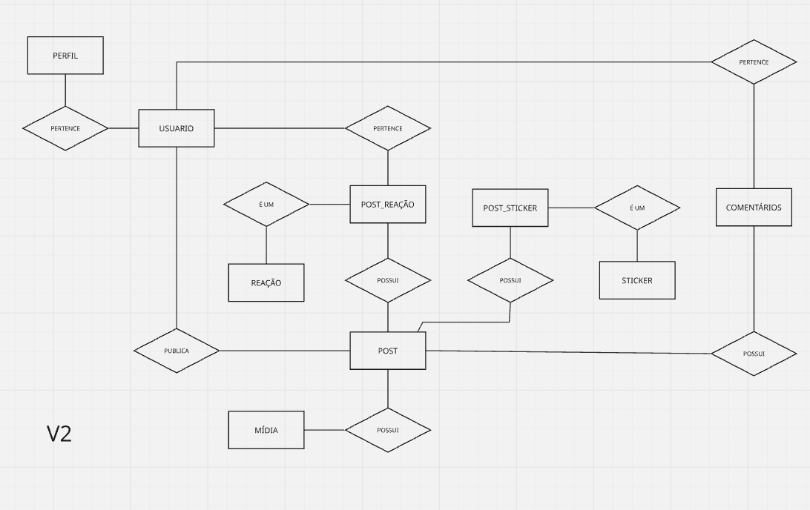
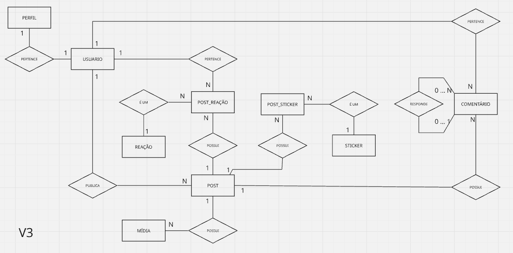
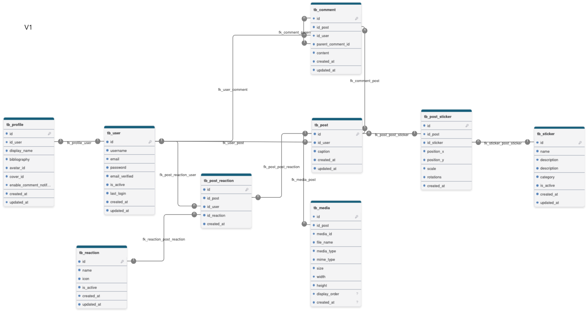

## Criar, configurar e iniciar o projeto (1)

### Setup base

- [X] criar projeto
- [X] configurar containers (aplicação e banco de dados)
- [X] iniciar projeto webapp
- [X] configurar pom.xml  [1]
- [X] rodar projeto para validar
- [X] iniciar projeto webapp

```bash
  mvn archetype:generate \
  -DgroupId=com.camaguru \
  -DartifactId=app \
  -DarchetypeArtifactId=maven-archetype-webapp \
  -DinteractiveMode=false
```

- [X] configurar pom.xml

```bash
<properties>
	<maven.compiler.source>1.8</maven.compiler.source>
	<maven.compiler.target>1.8</maven.compiler.target>
</properties>

[...]

<dependency>
      <groupId>javax.servlet</groupId>
      <artifactId>javax.servlet-api</artifactId>
      <version>4.0.1</version>
      <scope>provided</scope>
</dependency>


[...]

<build>
	<finalName>app</finalName>

	<plugins>

          <plugin>
              <groupId>org.apache.tomcat.maven</groupId>
              <artifactId>tomcat7-maven-plugin</artifactId>
              <version>2.2</version>

              <configuration>
                  <port>8080</port>
                  <path>/</path>
              </configuration>

          </plugin>

      </plugins>
</build>
```

---

## Criar estrutura MVC e configurar Eclipse (2)

- [X] criar estrutura MVC
- [X] criar primeira rota [2]

- rota criada no "/" mas para que funcionasse passando pelo servlet precisei apagar index.jsp e a rota do controller(homeServlet) ficou na raiz e após ao carregamento de dados é feito redirecionamento para home.jsp.
- as páginas *.jsp ficarão dentro de webapp/views (coloquei na WEB-INF mas mudei [3])
- ajustar eclipse para poder iniciar, parar, reiniciar o tomcat que está dentro do container
- Para que funcione é preciso subir o container e realizar make debug para depois acionar o debug personalizado no eclipse e quando navegar na aplicação o fluxo será capturado no breakpoint. (decidi manter assim imaginando que com um ambiente via Gitlab por exemplo que após o CI/CD realizar deploy da aplicação posso navegar nela e apenas anexar o debug do eclipse se quiser para realizar debug remoto.)
- passos:

  - make up
  - make debug
  - acionar o Debug personalizado no Eclipse (não esquecer de colocar o breakpoint)
  - navegar no ponto desejado da aplicação

- [X] ajustar eclipse para debug da aplicação, [4]

- precisei expor a porta `5005` de debug(docker-compose.yml) e criei o **make run** para rodar a aplicação sem brakepoint e **make debug**  para subir com com a porta que a IDE irá anexar o debug.
- no Eclipse criei um Debug Configuration -> Remote Java Application -> passei URL + Porta para uma nova configuração
- Obs.: Precisei usar `127.0.0.1` pois não funcionou com `localhost` (não tenho certeza do motivo - ainda)

- [X] web.xml para interpretação das scriptlets no jsp

```xml
<?xml version="1.0" encoding="UTF-8"?>

<web-app
    xmlns="http://xmlns.jcp.org/xml/ns/javaee"
    xmlns:xsi="http://www.w3.org/2001/XMLSchema-instance"
    xsi:schemaLocation="
        http://xmlns.jcp.org/xml/ns/javaee
        http://xmlns.jcp.org/xml/ns/javaee/web-app_4_0.xsd"
    version="4.0">

</web-app>
```

Antes a resposta devolvida pelo servlet só era interpretada com:

```html
<h1><%= request.getAttribute("message") %></h1>
```

foi possível usar:

```html
<h1>${message}</h1>
```

---

## Configurar e testar acesso pela aplicação ao banco de dados (3)

- [ ] criar banco de dados no postgres (usar dbeaver para gerenciar o postgres)
- [ ] criar estrutura de tabelas necessárias (CRUD de Pets simples)
- [ ] configurar aplicação para se conectar com o banco de dados [5]

- configuração realizada com HikariCP (mesma dependência utilizada no Spring Data JPA) que entrega gerenciamento do pool de conexões com DB e velocidade nas chamadas.  *pom.xml

  - ```xml
    [...]
    <dependency>
    	<groupId>com.zaxxer</groupId>
    	<artifactId>HikariCP</artifactId>
    	<version>2.7.9</version>
    </dependency>
    [...]
    ```
- realizado também a criação de um factory para que juntamente com Hikari seja viável manter conexões e apenas alocar do pool uma conexão quando for realizar operações, com isso a aplicação se conecta ao realizar a primeira operçaão.
- coloquei log no container do banco com commands(pode-se ver no docker-composer) e com comando de logs é possível ver o postgres mostrando a query executada.

- [ ] realizar primeira conexão e consulta ao banco de dados para testar
- [ ] criar carga de dados no banco de dados

- conectando e interagindo com o DB via terminal:
- ```bash
  make exec-db

  psql -u $POSTGRES_USER -d $POSTGRES_DB
  ```

---

## Modelagem de dados

- [X] Modelagem conceitual (DER)

### V-Zero que dá início ao modelo:


- na modelagem, V0 considerei os principais domínios e simplificações
- falta incluir sticker
- falta avaliar as reações pois pode ser associado de maneira mais coerente.
- A princípio imagens de avatar e capa ficarão no perfil identificadas.

### V1 melhoria do modelo, representando catálogos



- nesta versão inclui a representação de catálogos de reações e de stickers
- como stickers não existem sozinhos, eles apenas são carregados para serem aplicados a uma imagem, deixei representado sem relações, em alguns caos os stickers podem ser acessados diretos por bucket no storage e não passam pelo modelo, decidi fazer desta forma pois irei tratar o bucket manualmente no servidor de aplicação assim como habilitar e desabilitar o uso de stickers.
- tipo_reação também é um catálogo, e ele é acionado quando uma reação ocorre em um post por um usuário, assim a tabela reação apenas associa as 3 entidades.
- sticker não tem relação com ninguém nessa versão pois ele é materializado dentro de uma imagem editada, ele existe apenas como catálogo sob esta ótica.

### V2 trata relação de sticker e reação para amadurecer modelo de forma escalável, analítica e configurável.



- neste caso decidi trabalhar mais nas relações de reação e sticker de forma a evitar possível n:n mais pra frente e também para atender uma ideia que tive que é responder perguntas mais analíticas sobre reações e stickers e seus usos assim como configurá-los de forma extensível sem atingir o modelo futuramente.,
- mudei o nome para ficar mais claro o que é domínio e evento

### V3 refinando, adicionando autorelacionamento no comentário.



- adicionado auto-relacionamento em comentário para que seja possível desenvolver a funcionalidade de comentários que respondem outros comentários, algo que poderia ser feito posteriormente, porém apliquei a prática de auto-relacionamento logo no início do projeto. [6]
- também declarei no modelo as cardinalidades que estão presentes atualmente no modelo.
- cada entidade possui identidade própria e motivo para existir de forma independente.
- a partir deste ponto pode ser possível a criação do modelo lógico e revisão de regras, requisitos e posteriormente criação do dicionário de dados.
- depois dessa etapa precisam ser criadas no modelo entidades de parametrização que irá gerar uma V4...

- [X] Modelo Lógico

### V1 Modelo lógico com atributos e cardinalidades



- criei o modelo lógico com as relações e cardinalidades, porém nesta etapa já foi possível perceber possíveis melhorias como a inclusão de tabelas de parametrização da aplicação.
- percebo que pode ser interessante colocar atributos updated_at e is_active em entidades que não tem, e acrescer talvez atributo para soft delete.

- [X] Dicionário de dados.

- criei um documento de dicionário de dados que evolui junto com a modelagem lógica e conceitual a partir do momento que comecei a criar os atributos na modelagem lógica.

> docs/06-modelo_dados.md


## V4 do modelo conceitual (modelo principal)


- evoluindo modelo para que usuários possam seguir outros usuários.
- simplificação da entidade de Mídia (media) pois diversos attr ficarão sob responsabilidade da parametrização.
- também criarei outros modelos que estão diretamente ligados ao principal, mas visualmente separados para evitar confusão visual


## V2 do modelo lógico correspondendo a V4 do modelo conceitual.


- neste caso o modelo lógico apenas refletiu as alterações do conceitual e simplficiação de entidade conforme mencionado anteriormente.

- dicionário de dados atualizado.


- [ ] Materializar modelo em Banco de dados Postgres(schema criado)
- [ ] Criar massa inicial para validar modelo e iniciar desenvolvimento (seed))

## Comandos usados

- limpar projeto e realizar rebuild baixando dependências se necessário.
- ```b
  mvn clean package
  ```
- subir servidor tomcat que foi configurado na aplicação
- ```b
  mvn tomcat7:run
  ```
- limpar projeto e realizar update de pacotes do maven a partir do pom.xml
- ```bash
  mvn clean install
  ```

---

## Pesquisas

[1] https://tomcat.apache.org/

[2] https://www.devmedia.com.br/introducao-ao-java-server-pages-jsp/25602

[3] https://cursos.alura.com.br/forum/topico-duvida-sobre-acesso-ao-diretorio-web-inf-186697
[3.1] https://www.guj.com.br/t/sobre-a-pasta-web-inf/193676/

[4] https://stackoverflow.com/questions/3835612/remote-debugging-tomcat-with-eclipse
[4.1] https://medium.com/@maneakanksha772/debugging-java-inside-a-docker-container-a-survival-guide-c2eee1655434

[5] https://medium.com/@mittulsharma07/mastering-java-connecting-to-postgresql-using-jdbc-a-beginners-guide-9e5189d23d88
[5.1] https://www.baeldung.com/hikaricp
[5.2] https://oneuptime.com/blog/post/2026-03-31-mysql-hikaricp-connection-pool-java/view
[5.3] https://en.oceanbase.com/docs/common-oceanbase-database-10000000000829756
[5.4] https://stackoverflow.com/questions/21034462/how-to-use-a-factory-pattern-to-get-the-instance-of-my-database-client
[5.5] https://refactoring.guru/design-patterns/factory-method
[5.6] https://medium.com/@ucgorai/understanding-and-using-the-factory-design-pattern-in-java-06dcb8458983

[6] [www.alura.com.br/artigos/relacionamento-reflexivo-modelagem-banco-de-dados?srsltid=AfmBOorIO-5ma0glXvj_hbs5ORXdaUVOY_Tu8j6lRGnMZ4nJNvR9D9h-](https://www.alura.com.br/artigos/relacionamento-reflexivo-modelagem-banco-de-dados?srsltid=AfmBOorIO-5ma0glXvj_hbs5ORXdaUVOY_Tu8j6lRGnMZ4nJNvR9D9h-)

[6.1] [www.inf.ufes.br/~jssalamon/wp-content/uploads/disciplinas/engsoft/slides/Slide%206%20-%20Modelagem%20de%20Entidades%20e%20Relacionamentos.pdf](<https://www.inf.ufes.br/~jssalamon/wp-content/uploads/disciplinas/engsoft/slides/Slide%206%20-%20Modelagem%20de%20Entidades%20e%20Relacionamentos.pdf>)

[6.2] [www.youtube.com/watch?v=0hWbjOT_I4M](https://www.youtube.com/watch?v=0hWbjOT_I4M)

[6.3] [www.youtube.com/watch?v=OQQmjbGX9nM](https://www.youtube.com/watch?v=OQQmjbGX9nM)
