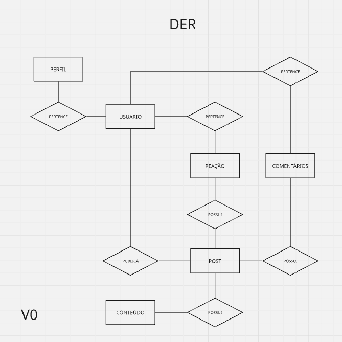
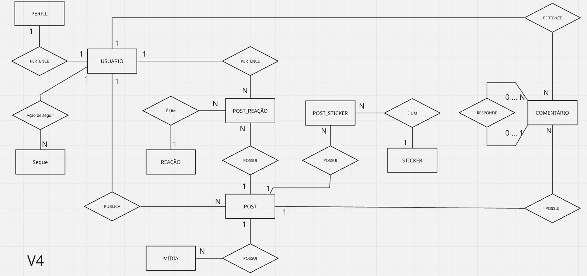
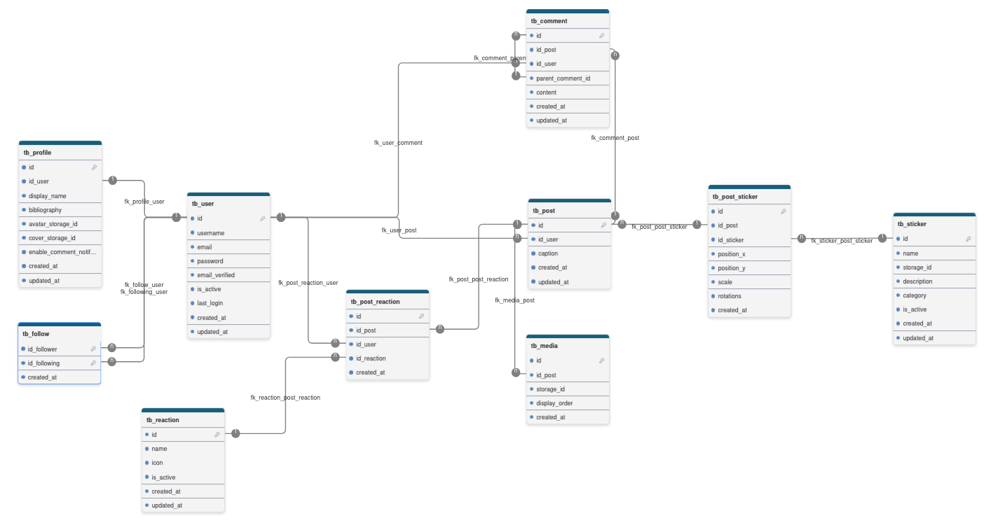
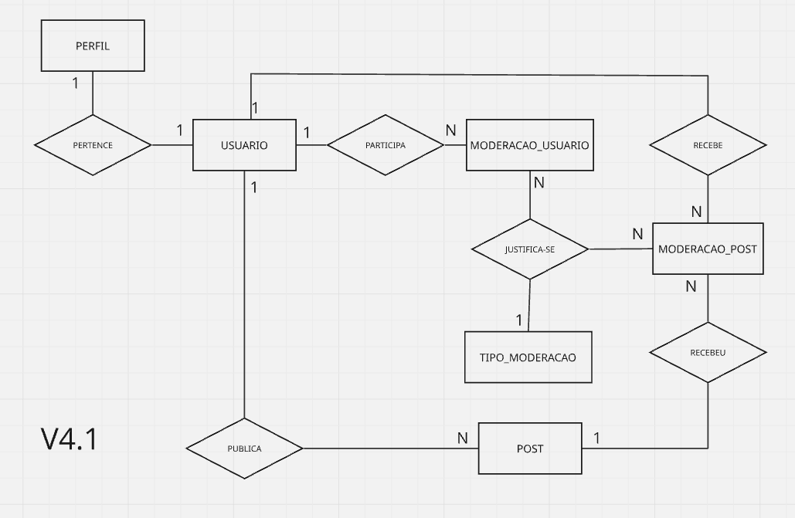
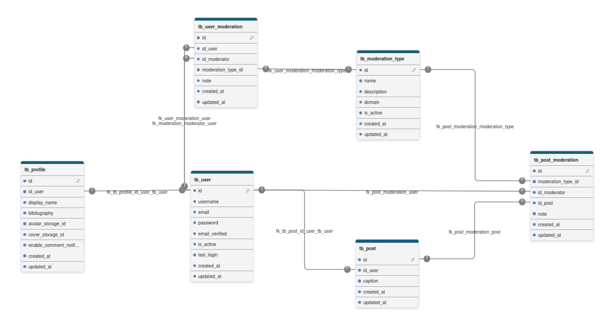
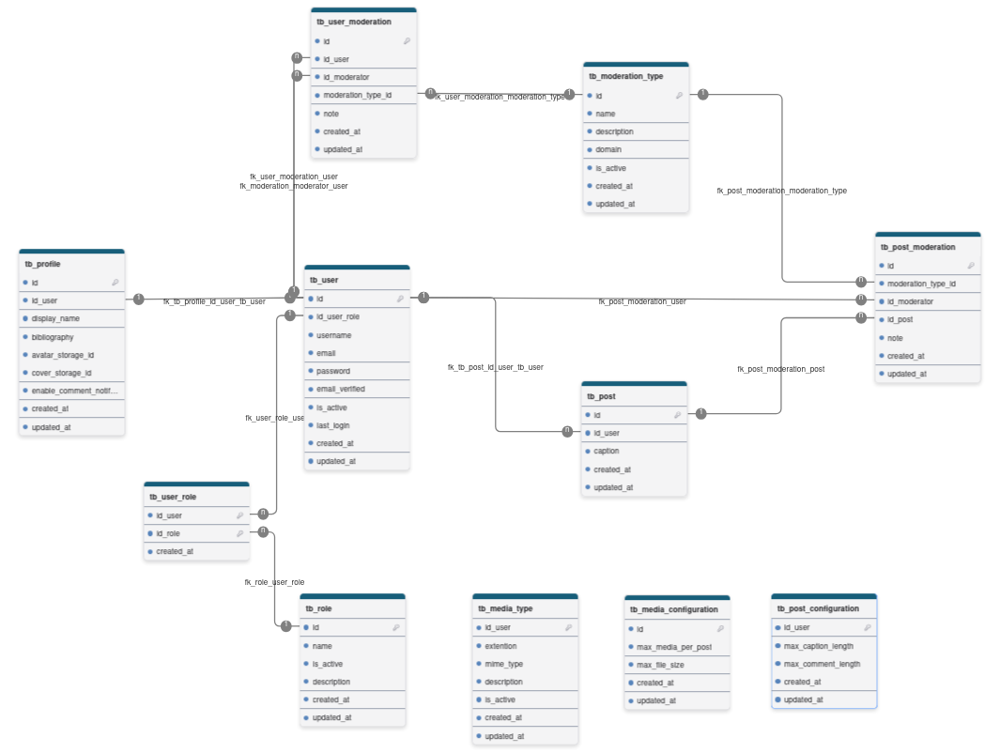

# Modelagem de dados

- [X] Modelagem conceitual (DER)

### V-Zero que dá início ao modelo:



- na modelagem, V0 considerei os principais domínios e simplificações
- falta incluir sticker
- falta avaliar as reações pois pode ser associado de maneira mais coerente.
- A princípio imagens de avatar e capa ficarão no perfil identificadas.

### V1 melhoria do modelo, representando catálogos


- nesta versão inclui a representação de catálogos de reações e de stickers
- como stickers não existem sozinhos, eles apenas são carregados para serem aplicados a uma imagem, deixei representado sem relações, em alguns caos os stickers podem ser acessados diretos por bucket no storage e não passam pelo modelo, decidi fazer desta forma pois irei tratar o bucket manualmente no servidor de aplicação assim como habilitar e desabilitar o uso de stickers.
- tipo_reação também é um catálogo, e ele é acionado quando uma reação ocorre em um post por um usuário, assim a tabela reação apenas associa as 3 entidades.
- sticker não tem relação com ninguém nessa versão pois ele é materializado dentro de uma imagem editada, ele existe apenas como catálogo sob esta ótica.

### V2 trata relação de sticker e reação para amadurecer modelo de forma escalável, analítica e configurável.


- neste caso decidi trabalhar mais nas relações de reação e sticker de forma a evitar possível n:n mais pra frente e também para atender uma ideia que tive que é responder perguntas mais analíticas sobre reações e stickers e seus usos assim como configurá-los de forma extensível sem atingir o modelo futuramente.,
- mudei o nome para ficar mais claro o que é domínio e evento

### V3 refinando, adicionando autorelacionamento no comentário.


- adicionado auto-relacionamento em comentário para que seja possível desenvolver a funcionalidade de comentários que respondem outros comentários, algo que poderia ser feito posteriormente, porém apliquei a prática de auto-relacionamento logo no início do projeto. [1]
- também declarei no modelo as cardinalidades que estão presentes atualmente no modelo.
- cada entidade possui identidade própria e motivo para existir de forma independente.
- a partir deste ponto pode ser possível a criação do modelo lógico e revisão de regras, requisitos e posteriormente criação do dicionário de dados.
- depois dessa etapa precisam ser criadas no modelo entidades de parametrização que irá gerar uma V4...

- [X] Modelo Lógico

### V1 Modelo lógico com atributos e cardinalidades


- criei o modelo lógico com as relações e cardinalidades, porém nesta etapa já foi possível perceber possíveis melhorias como a inclusão de tabelas de parametrização da aplicação.
- percebo que pode ser interessante colocar atributos updated_at e is_active em entidades que não tem, e acrescer talvez atributo para soft delete.

- [X] Dicionário de dados.

- criei um documento de dicionário de dados que evolui junto com a modelagem lógica e conceitual a partir do momento que comecei a criar os atributos na modelagem lógica.

> docs/06-modelo_dados.md

## V4 do modelo conceitual (modelo principal)



- evoluindo modelo para que usuários possam seguir outros usuários.
- simplificação da entidade de Mídia (media) pois diversos attr ficarão sob responsabilidade da parametrização.
- também criarei outros modelos que estão diretamente ligados ao principal, mas visualmente separados para evitar confusão visual

## V2 do modelo lógico correspondendo a V4 do modelo conceitual.



- neste caso o modelo lógico apenas refletiu as alterações do conceitual e simplficiação de entidade conforme mencionado anteriormente.
- dicionário de dados atualizado.
- considero a parte acima como ==módulo social== e depois pude implementar o ==módulo de moderação== e ==módulo de administração==

### Módulo de moderação (modelo de dados)



- Em uma visão simplificada do modelo que mostra a relação de usuário com post eu deixei visível de forma clara e simples que um post poderá ser moderado por um moderador
- a moderação precisa ser justificada, na prática o post pode ser bloqueado, desbloqueado, etc. de forma a permitir a moderação interagir com usuário(não está previsto aqui) e baseado em alguma justificativa liberar o post novamente, por exemplo.
- o mesmo padrão de moderação foi aplicado para usuários, com isso tipo_moderação terá o domínio específicado para evitar duas tabelas.



- diagrama lógico simplificado da moderação

### Módulo administração (modelo de dados)


- finalizando o modelo na versão V4.2 incluindo depois da moderação as configurações de mídia, post e papel do usuário 9que viabiliza área administrativa e de moderação.
- com isso foi incluído uma relação com usuário, onde um atributo novo foi incluído na entidade usuário.
- como usuário pode ser admin e usuário normal da rede assim como o modeador... então um usuário pode der um ou mais papéis, pra resolver isso coloquei entidade associativa.

### Modelo lógico da administração e moderação



- eu até coloquei boolean para saber se está habilitado post com mais de uma mídia ou não, mas depois mudei de ideia pois pode ser feito  pelo campo de max_media_per_post.
- analisando o contexto geral do modelo consigo perceber:
  - **Rede Social**
    - usuário
    - Perfil
    - Post
    - Midia
  - **Segurança**
    - Papel
    - usuário_papel
  - **Moderação**
    - moderação_Post
    - Moderação_Usuário
    - Tipo_Moderação
  - **Administração**
    - Configuração_Post
    - Configuração_Mídia
    - Tipo_mídia.

## Considerações finais  quanto ao modelo de dados

- aqui considero a versão 4 + 4.2 do modelo conceitual  incluindo versão 2 + 2.1 do modelo lógico concluídos para serem materializadas e testadas.
- A partir deste ponto irei atualizar documentos do projeto para que possam refletir a conclusão do modelo pois indo além do que é mandatório do projeto, ja será estabelecido aplicação do bônus, onde quero:
  - aplicar admin, moderçaão, reações além de curtir e stickers assim como análise da rede pela visão do admin.

---

- [ ] Materializar modelo em Banco de dados Postgres(schema criado)
- [ ] Criar massa inicial para validar modelo e iniciar desenvolvimento (seed))

## Comandos usados

- limpar projeto e realizar rebuild baixando dependências se necessário.
- ```b
  mvn clean package
  ```
- subir servidor tomcat que foi configurado na aplicação
- ```b
  mvn tomcat7:run
  ```
- limpar projeto e realizar update de pacotes do maven a partir do pom.xml
- ```bash
  mvn clean install
  ```

---

## Bibliografia

[1] [www.alura.com.br/artigos/relacionamento-reflexivo-modelagem-banco-de-dados?srsltid=AfmBOorIO-5ma0glXvj_hbs5ORXdaUVOY_Tu8j6lRGnMZ4nJNvR9D9h-](https://www.alura.com.br/artigos/relacionamento-reflexivo-modelagem-banco-de-dados?srsltid=AfmBOorIO-5ma0glXvj_hbs5ORXdaUVOY_Tu8j6lRGnMZ4nJNvR9D9h-)

[1.1] [www.inf.ufes.br/~jssalamon/wp-content/uploads/disciplinas/engsoft/slides/Slide%206%20-%20Modelagem%20de%20Entidades%20e%20Relacionamentos.pdf](<https://www.inf.ufes.br/~jssalamon/wp-content/uploads/disciplinas/engsoft/slides/Slide%206%20-%20Modelagem%20de%20Entidades%20e%20Relacionamentos.pdf>)

[1.2] [www.youtube.com/watch?v=0hWbjOT_I4M](https://www.youtube.com/watch?v=0hWbjOT_I4M)

[1.3] [www.youtube.com/watch?v=OQQmjbGX9nM](https://www.youtube.com/watch?v=OQQmjbGX9nM)
